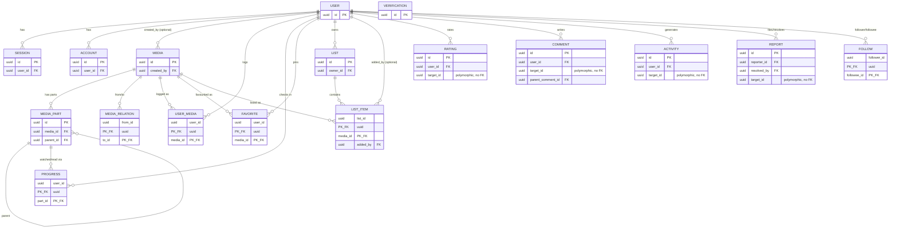

# Data model

This documents Trackt's Postgres schema (`packages/db/src/schema/`): the tables, their
relationships, and the design decisions that aren't obvious from the columns alone.

## Relationship overview

Entities only, with just the key columns needed to read the relationships — no
status/enum/timestamp fields. See [Table details](#table-details) below for the
full column list per table.

## Table details

Full column list per table, grouped by schema file, with no relationship lines —
easier to scan than the diagram above. Foreign keys are still marked (`FK`) but
arrows are omitted; cross-reference the relationship overview for how tables connect.

```mermaid
erDiagram
    USER {
        uuid id PK
        text name
        text email UK
        boolean email_verified
        text image
        text username UK
        text display_username
        text bio
        jsonb social_links
        user_role role
        timestamptz created_at
        timestamptz updated_at
    }

    SESSION {
        uuid id PK
        uuid user_id FK
        text token UK
        timestamptz expires_at
        text ip_address
        text user_agent
        timestamptz created_at
        timestamptz updated_at
    }

    ACCOUNT {
        uuid id PK
        uuid user_id FK
        text account_id
        text provider_id
        text access_token
        text refresh_token
        text id_token
        timestamptz access_token_expires_at
        timestamptz refresh_token_expires_at
        text scope
        text password
        timestamptz created_at
        timestamptz updated_at
    }

    VERIFICATION {
        uuid id PK
        text identifier
        text value
        timestamptz expires_at
        timestamptz created_at
        timestamptz updated_at
    }

    MEDIA {
        uuid id PK
        media_kind kind
        text title
        text original_title
        text slug UK
        text synonyms "array"
        text genres "array"
        integer year
        integer part_count
        integer season_number
        text description
        text cover_url
        date release_date
        media_status status
        jsonb external_ids
        jsonb metadata
        media_source source
        uuid created_by FK
        moderation_status moderation
        uuid community_uuid
        timestamptz deleted_at
        timestamptz created_at
        timestamptz updated_at
    }

    MEDIA_PART {
        uuid id PK
        uuid media_id FK
        uuid parent_id FK
        part_kind kind
        numeric number
        text title
        date air_date
        jsonb metadata
    }

    MEDIA_RELATION {
        uuid from_id PK_FK
        uuid to_id PK_FK
        media_relation_type type PK
        timestamptz created_at
    }

    USER_MEDIA {
        uuid user_id PK_FK
        uuid media_id PK_FK
        log_status status
        integer repeats
        date started_at
        date finished_at
        text notes
        timestamptz created_at
        timestamptz updated_at
    }

    PROGRESS {
        uuid user_id PK_FK
        uuid part_id PK_FK
        integer repeat_index PK
        timestamptz watched_at
    }

    FAVORITE {
        uuid user_id PK_FK
        uuid media_id PK_FK
        media_kind kind
        integer position
    }

    LIST {
        uuid id PK
        uuid owner_id FK
        text title
        text description
        boolean is_ranked
        boolean is_collaborative
        visibility visibility
        timestamptz created_at
        timestamptz updated_at
    }

    LIST_ITEM {
        uuid list_id PK_FK
        uuid media_id PK_FK
        integer position
        uuid added_by FK
        timestamptz created_at
    }

    RATING {
        uuid id PK
        uuid user_id FK
        target_type target_type
        uuid target_id "polymorphic, no FK"
        numeric score
        text review
        boolean has_spoilers
        timestamptz created_at
        timestamptz updated_at
    }

    COMMENT {
        uuid id PK
        uuid user_id FK
        target_type target_type
        uuid target_id "polymorphic, no FK"
        uuid parent_comment_id FK
        text body
        boolean has_spoilers
        boolean is_hidden
        timestamptz created_at
        timestamptz updated_at
    }

    FOLLOW {
        uuid follower_id PK_FK
        uuid followee_id PK_FK
        timestamptz created_at
    }

    ACTIVITY {
        uuid id PK
        uuid user_id FK
        text verb
        text target_type "polymorphic, no FK"
        uuid target_id "polymorphic, no FK"
        jsonb metadata
        timestamptz created_at
    }

    REPORT {
        uuid id PK
        uuid reporter_id FK
        text target_type "polymorphic, no FK"
        uuid target_id "polymorphic, no FK"
        text reason
        report_status status
        uuid resolved_by FK
        timestamptz resolved_at
        timestamptz created_at
    }
```

## Table groups

The schema is organized into five files under `packages/db/src/schema/`, mirrored above:

- **`auth.ts`** — `user`, `session`, `account`, `verification`. Follows better-auth's
  core schema, extended with Trackt profile fields (`username`, `bio`, `social_links`).
- **`media.ts`** — `media`, `media_part`, `media_relation`. The catalog: one row per
  work (per season, for series/anime — ADR-0003), a generic structural hierarchy for
  episodes/chapters, and typed directed edges between works (ADR-0004).
- **`tracking.ts`** — `user_media`, `progress`. The per-user log (status/dates/notes)
  and the append-only per-episode/chapter check-in ledger.
- **`lists.ts`** — `favorite`, `list`, `list_item`. Pinned profile favourites and
  user-curated lists.
- **`social.ts`** — `rating`, `comment`, `follow`, `activity`, `report`. Social and
  moderation surface, several of which are polymorphic (see below).

## Notable design decisions

- **`user_id` leads every user-owned table.** Called out in `tracking.ts` as the
  future shard key if Trackt needs to shard by user.
- **Polymorphic targets, no FK.** `rating`, `comment`, `activity`, and `report` all
  reference their subject via a bare `(target_type, target_id)` pair instead of a
  foreign key, so one table can target `media`, a `media_part`, a `user`, or a `list`.
  This is a deliberate tradeoff: it avoids one join table per target kind, but it means
  a hard `DELETE FROM media` leaves these rows dangling (see the warning in `media.ts`).
  Prefer the `deleted_at` soft-delete path over hard deletes for exactly this reason.
- **`media_relation` is directed and stored once per edge.** `(from_id, to_id, type)`
  captures e.g. "S1 →sequel→ S2"; the inverse reading (prequel/source/parent) is
  derived in `@trackt/shared` rather than stored, so materializing an edge is
  idempotent and there's no risk of the two directions drifting apart.
- **`media_part` is a self-referencing generic hierarchy**, reused for both
  season→episode (video) and volume→chapter (print) via `parent_id` and `part_kind`.
- **Catalog rows use deterministic UUIDv5 IDs** for provider-identified works (synced
  from the central slim catalog, ADR-0001); user-created rows get random UUIDs and
  start in the `unverified` moderation queue.
- **Soft delete vs. hard delete on `media`.** `deleted_at` is the sanctioned way to
  pull a title from circulation — it keeps all dependent user data intact and is
  enforced at the central visibility seam (`apps/api/src/lib/visibility.ts`). Hard
  deletes cascade through `user_media`, `favorite`, `list_item`, and `progress` (via
  `media_part`), but silently orphan the polymorphic tables listed above.
- **`user_media.started_at` / `finished_at` are `date`, one pair per log** (ADR-0007).
  A viewing start is a day, not an instant, and a day typed in by hand has no timezone
  to get wrong. They are stamped by status changes and the first check-in — always
  `COALESCE`d, so a real start date is never overwritten — and editable through
  `PATCH /v1/media/:id/log`. `COALESCE(finished_at, started_at)` is the expression the
  history page files, sorts, pages and facets on; `user_media_user_logged_idx` indexes
  it per user. Dated *rewatch runs* are deliberately not modelled here: that needs a
  `media_run` table, and `repeats` / `progress.repeat_index` stay unused until it lands.
- **`progress` is append-only and write-heavy** — one row per watched episode/read
  chapter per repeat (rewatches/rereads), flagged in-schema as the first candidate for
  native partitioning by month.
- **`activity` is fan-out-on-read**, not fan-out-on-write: one row per event, consumed
  by querying followees at read time rather than writing to every follower's feed.

## Related documents

- [`docs/adr/0001-central-slim-catalog.md`](adr/0001-central-slim-catalog.md) — canonical UUIDv5 IDs, central catalog sync
- [`docs/adr/0002-federated-catalog-search.md`](adr/0002-federated-catalog-search.md) — search architecture over this schema
- [`docs/adr/0003-per-season-media.md`](adr/0003-per-season-media.md) — why `media` is one row per season
- [`docs/adr/0004-typed-media-relations.md`](adr/0004-typed-media-relations.md) — the `media_relation` design
- [`docs/PRD.md`](PRD.md) — product requirements referenced throughout the schema comments
